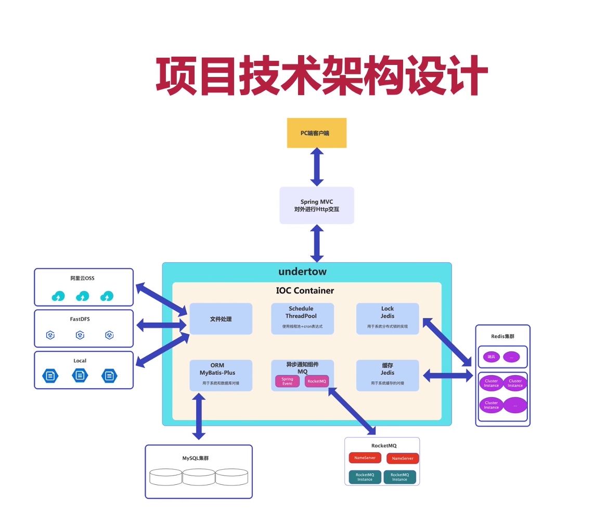

# G-Could

#### 介绍
私人分布式云盘存储系统项目

#### 一、项目特点

1. 完全模块化的架构体系，摆脱单体的臃肿与笨重
2. 插件式集成主流存储软件，如FastDFS、OSS
3. 集成Caffeine、Redis，提供并发读的商业级别缓存解决方法
4. 集成Redis，Zookeeper，提供高并发写的商业级数据一致性的解决方案
5. 使用“零拷贝”技术搭建本地高效的存储引擎

#### 二、项目流程

>架构选型 --> 项目开发 --> 项目优化 --> 项目上线

#### 三、技术栈

1. 前端：VUE3.0、Element-Plus、Pinia
2. 后端：SpringBoot、SpringMVC、Mybatis-Plus、Spring Cache、Spring Integration
3. 中间件: RockeMQ、Zookeeper、Caffeine、Redis
4. 数据存储：MySQL、OSS、FastDFS
5. 管理工具:  Maven、Swagger

#### 四、项目功能模块

###### 1. 用户模块

​	用户登录

​	用户注册

​	忘记密码

​	在线修改密码

​	用户退出账号

​	用户的搜索历史

###### 2. 文件模块

​	创建文件夹

​	上传文件（照片， 多种格式类型文档，视频， 音乐）

​	在线查看各类文件

​	下载文件

​	重命名文件/文件夹

​	删除文件/文件夹

​	复制文件/文件夹

​	移动文件/文件夹

​	查询和搜索文件

###### 3. 回收站模块

​	查询回收站内文件

​	清空回收站

​	还原文件

###### 4. 分享模块	

​	创建分享

​	查看分享

​	取消分享

​	保存到我的盘符中

​	文件下载

#### 五、各模块技术点

###### 1. 用户模块

 全局用户信息上下文的搭建：拦截器 + JWT全局Token + ThreadLocal

###### 2. 文件模块

优化文件上传下载 ``SendFile零拷贝，文件软连接``

文件上传，断点续传，秒传``文件唯一ID + 缓存文件分片``

文件快速移动、复制``文件软连接``

文件系统对接第三方存储``使用到策略模式抽象``  (OSS、FastDFS)

#### 六、项目技术架构设计

